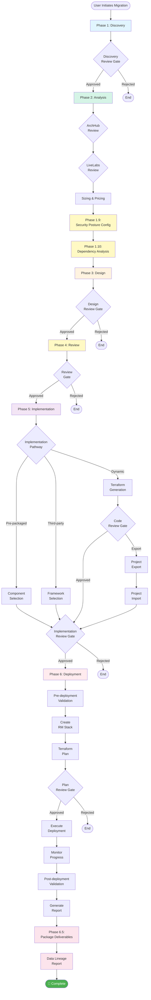

# Cloud Migration Agent Specification - Complete Documentation

**Version:** 4.2.0  
**Last Updated:** June 2026  
**Architecture:** 6-Phase Workflow with Multiple Review Gates

---

## Table of Contents

1. [Overview](#overview)
2. [Architecture Summary](#architecture-summary)
3. [Six-Phase Workflow](#six-phase-workflow)
4. [Phase Details](#phase-details)
5. [Review Gates](#review-gates)
6. [MCP Tool Servers](#mcp-tool-servers)
7. [Knowledge Base Integration](#knowledge-base-integration)
8. [State Schema](#state-schema)
9. [Feature Flags](#feature-flags)
10. [Implementation Pathways](#implementation-pathways)
11. [Evaluation Harness](#evaluation-harness)
12. [API Endpoints Reference](#api-endpoints-reference)
13. [UI Tab Structure](#ui-tab-structure)

---

## Overview

The Cloud Migration Agent Platform is an **AI-powered, agentic system** designed to migrate cloud workloads from any provider (AWS, Azure, GCP, On-Premises) to Oracle Cloud Infrastructure (OCI). The platform employs a **6-phase workflow** with **multiple human review gates** to ensure accuracy, compliance, and user control throughout the migration journey.

### Key Features

- ✅ **6-Phase Migration Workflow** - Structured progression from discovery to deployment
- ✅ **Multiple Review Gates** - Human-in-the-loop validation at critical junctures
- ✅ **Knowledge Base Engine** - Structured rules/scenarios/risk engine (`mcp_kb`) with 9 tools across 6 migration domains
- ✅ **MCP Tool Ecosystem** - 16 MCP servers for specialized tasks across all migration phases
- ✅ **Multi-Cloud Mapping** - AWS/Azure/GCP→OCI service mapping via YAML knowledge files (65/36/44 entries)
- ✅ **Terraform Code Generation** - 13 OCI module generators with dependency analysis and wave optimization
- ✅ **Reference Architecture Templates** - 13 patterns with inline HCL (OKE, 3-tier, DR, ML, data lake, and more)
- ✅ **OCI Resource Manager Integration** - Direct deployment via OCI RM stacks with job monitoring
- ✅ **Real-time Monitoring** - SSE streaming for deployment progress
- ✅ **Comprehensive Validation** - Pre/post-deployment checks via `deployment_monitor` server
- ✅ **Risk & Cost Analysis** - On-demand risk assessment and cost optimization recommendations
- ✅ **Adaptive Agent Selection** - Complexity-based agent routing (structured vs. ReAct)
- ✅ **Compliance Framework Enforcement** - User-selectable frameworks: CIS, HIPAA, PCI-DSS, SOC2, GDPR, ISO27001, FedRAMP
- ✅ **Dependency Constraint System** - Configurable wave size, excluded services, manual overrides, sequential mode
- ✅ **Data Lineage Tracking** - Full provenance report across 16 state fields and all workflow agents
- ✅ **Evaluation Harness** - 4 scenarios × 6 phases with invariant checking and accuracy metrics

### Architecture Principles

1. **Phased Execution** - Clear separation of concerns across 6 phases
2. **Checkpointing** - Persistent state stored in Oracle 23ai after each node
3. **Human-in-the-Loop** - Mandatory review gates for critical decisions
4. **Tool Abstraction** - MCP protocol for standardized tool interfaces
5. **LLM-Powered Intelligence** - OCI Generative AI (Cohere Command R+) for reasoning
6. **Structured Knowledge** - Rules/scenarios engine backed by structured YAML files (not vector DB)
7. **Observability** - Comprehensive tracing, logging, and event emission

---

## Architecture Summary

```
┌─────────────────────────────────────────────────────────────────┐
│                   Cloud Migration Platform                       │
│                     6-Phase Agentic Workflow                     │
└─────────────────────────────────────────────────────────────────┘
                              │
                              ▼
    ┌──────────────────────────────────────────────────────┐
    │  PHASE 1: DISCOVERY                                  │
    │  • Document ingestion (PDF, DOCX, BOM)              │
    │  • Evidence extraction                               │
    │  • Gap detection (80% confidence threshold)          │
    │  • Clarifications loop                               │
    └──────────────────────────────────────────────────────┘
                              │
                              ▼
    ┌──────────────────────────────────────────────────────┐
    │  PHASE 1.5: DISCOVERY REVIEW GATE                    │
    │  • User reviews discovered architecture              │
    │  • Approve / Request Changes / Reject                │
    └──────────────────────────────────────────────────────┘
                              │
                              ▼
    ┌──────────────────────────────────────────────────────┐
    │  PHASE 2: ANALYSIS                                   │
    │  • Reconstruct current state                         │
    │  • ArchHub reference architectures                   │
    │  • LiveLabs workshops                                │
    │  • OCI target design                                 │
    │  • Sizing & pricing estimates                        │
    └──────────────────────────────────────────────────────┘
                              │
                              ▼
    ┌──────────────────────────────────────────────────────┐
    │  PHASE 3: DESIGN                                     │
    │  • Formal architecture modeling                      │
    │  • State machine with components & dependencies      │
    │  • Diagram generation (logical, sequence, Gantt)     │
    │  • Build plan (topological sort)                     │
    └──────────────────────────────────────────────────────┘
                              │
                              ▼
    ┌──────────────────────────────────────────────────────┐
    │  PHASE 3.5: DESIGN REVIEW GATE                       │
    │  • User reviews formal architecture design           │
    │  • Approve / Request Changes / Reject                │
    └──────────────────────────────────────────────────────┘
                              │
                              ▼
    ┌──────────────────────────────────────────────────────┐
    │  PHASE 4: REVIEW                                     │
    │  • Final validation & compliance checks              │
    │  • Iterative feedback incorporation                  │
    │  • User approval before implementation               │
    └──────────────────────────────────────────────────────┘
                              │
                              ▼
    ┌──────────────────────────────────────────────────────┐
    │  PHASE 5: IMPLEMENTATION                             │
    │  • Strategy selection (3 pathways)                   │
    │    - Pre-packaged components                         │
    │    - Dynamic Terraform generation                    │
    │    - Third-party frameworks                          │
    │  • Code generation & validation                      │
    │  • Code review gate                                  │
    │  • Project export/import for modifications           │
    └──────────────────────────────────────────────────────┘
                              │
                              ▼
    ┌──────────────────────────────────────────────────────┐
    │  PHASE 6: DEPLOYMENT                                 │
    │  • Pre-deployment validation                         │
    │  • OCI Resource Manager stack creation               │
    │  • Terraform plan review                             │
    │  • Deployment execution & monitoring                 │
    │  • Post-deployment validation                        │
    │  • Report generation & deliverables packaging        │
    └──────────────────────────────────────────────────────┘
                              │
                              ▼
                       ┌─────────────┐
                       │ COMPLETE 🎉 │
                       └─────────────┘
```

---

## Six-Phase Workflow

### Phase Progression

| Phase | Name | Type | Confidence Threshold | Review Gate |
|-------|------|------|---------------------|-------------|
| 1 | **Discovery** | Automated | 80% minimum | Phase 1.5 |
| 1.5 | **Discovery Review** | Human Review | N/A | Yes |
| 2 | **Analysis** | Automated | N/A | Multiple (ArchHub, LiveLabs) |
| 3 | **Design** | Automated | N/A | Phase 3.5 |
| 3.5 | **Design Review** | Human Review | N/A | Yes |
| 4 | **Review** | Human Review | 90% approval | Yes |
| 5 | **Implementation** | Automated + Human | N/A | Code Review Gate |
| 6 | **Deployment** | Automated + Human | N/A | Plan Review Gate |

### Critical Path Nodes

The workflow contains **60 nodes** in total:
- **Automated Agents:** 46 nodes
- **Human Review Gates:** 10 nodes
- **Parallel Execution:** 1 node (ArchHub, LiveLabs, KB parallel discovery)
- **Conditional Branching:** Multiple (based on review decisions, validation results, strategy selection)

> **New in v4.2.0:** `security_posture_config` (Phase 1.9), `dependency_analysis` (Phase 1.10), and
> `data_lineage` (Phase 6 final) added; `dependency_analysis` now honours 4 user-configurable
> constraint types; 5 on-demand nodes added for Phase 1.9, 1.10, 6.5, and data lineage views.
> `terraform_generation` uses 13 OCI-specific Terraform module generators
> (`mcp_terraform_generator`) plus `dependency_analysis` tools for wave optimization.
> `mapping` now supports AWS, Azure, and GCP sources via YAML-backed knowledge files.

---

## Phase Details

### PHASE 1: DISCOVERY

**Objective:** Extract and analyze source cloud architecture from evidence (documents, BoM, user input)

**Nodes:**
1. `intake_plan` - Intake migration request
2. `kb_enrich_discovery` - Enrich with KB intelligence
3. `document_ingestion` - Process PDFs, DOCX, diagrams
4. `bom_analysis` - Parse XLS/XLSX BoM for cost data
5. `extract_evidence` - Consolidate evidence
6. `gap_detection` - Identify missing information, calculate confidence
7. `clarifications_needed` - Request user clarifications if confidence < 80%

**Outputs:**
- `discovered_services` - Cloud services discovered
- `network_architecture` - VPCs, subnets, security groups
- `compute_resources` - Instance types and sizing
- `storage_resources` - Storage resources (S3, RDS, etc.)
- `security_posture` - IAM, security groups, compliance
- `gaps_identified` - Missing/ambiguous information
- `discovery_confidence` - Confidence score (0-1)

**Review Gate:** Phase 1.5 - Discovery Review
- User reviews discovered architecture
- Actions: Approve / Request Changes / Reject

---

### PHASE 2: ANALYSIS

**Objective:** Design target OCI architecture, estimate costs, configure compliance, and analyse dependencies

**Nodes:**
1. `reconstruct_current_state` - Build comprehensive current state model
2. `kb_enrich_analysis` - Enrich with KB intelligence
3. `requirements_normalize` - Normalize migration requirements
4. `parallel_discovery` - Run ArchHub, LiveLabs, KB in parallel
5. `archhub_review_gate` - User reviews Oracle reference architectures
6. `archhub_selection` - Process user selections
7. `livelabs_review_gate` - User reviews Oracle Live Labs workshops
8. `livelabs_selection` - Process user selections
9. `oci_target_design` - Design target OCI architecture (adaptive agent selection)
10. `sizing_pricing` - Calculate sizing and pricing estimates
11. `security_posture_config` *(Phase 1.9)* - User configures compliance frameworks (CIS, HIPAA, PCI-DSS, SOC2, GDPR, ISO27001, FedRAMP)
12. `dependency_analysis` *(Phase 1.10)* - Analyse Terraform module dependencies and compute optimised deployment waves

**Outputs:**
- `current_state` - Reconstructed current state
- `requirements` - Normalized requirements
- `archhub_intelligence` - Oracle Architecture Hub results
- `livelabs_intelligence` - Oracle Live Labs workshops
- `oci_service_mapping` - Source to OCI service mappings
- `target_design` - Complete OCI target architecture
- `pricing_estimate` - OCI cost estimates
- `savings_analysis` - Cost savings analysis
- `compliance_frameworks` - Selected compliance frameworks *(new)*
- `dependency_analysis` - Wave plan, conflict list, diagram, timeline *(new)*
- `dependency_analysis_status` - pending / completed / failed *(new)*
- `applied_constraints` - Record of which constraints were applied *(new)*

**Review Gates:** 
- ArchHub Review Gate
- LiveLabs Review Gate

---

### PHASE 1.9: SECURITY POSTURE CONFIGURATION *(User Configuration)*

**Objective:** Allow users to select which compliance frameworks to enforce before the design phase begins

**Node:** `security_posture_config`  
**API:** `POST /migrations/{id}/security-posture/configure` | `GET /migrations/{id}/security-posture`  
**UI Tab:** 🔒 Phase 1.9: Security Posture Config

**Supported Frameworks:**
| ID | Standard | Focus |
|----|----------|-------|
| `cis` | CIS Benchmarks | Secure configuration baselines |
| `hipaa` | HIPAA | Healthcare data privacy |
| `pci_dss` | PCI DSS | Payment card data security |
| `soc2` | SOC 2 Type II | Service organisation controls |
| `gdpr` | GDPR | EU data protection |
| `iso27001` | ISO 27001 | Information security management |
| `fedramp` | FedRAMP | US federal cloud security |

**Configuration Flow:**
1. User selects frameworks via checkbox group (UI) or JSON payload (API)
2. `compliance_frameworks` list stored in migration state
3. `SecurityPostureAgent` picks up frameworks in subsequent validation nodes

---

### PHASE 1.10: DEPENDENCY ANALYSIS CONFIGURATION *(User Configuration)*

**Objective:** Allow users to customise how deployment waves are computed before the design phase

**Node:** `dependency_analysis`  
**Agent:** `DependencyAnalysisAgent`  
**API:** `POST /migrations/{id}/dependency-analysis/configure` | `GET /migrations/{id}/dependency-analysis`  
**UI Tab:** 🔗 Phase 1.10: Dependency Config

**Constraint Types:**
| Constraint | Type | Effect |
|------------|------|--------|
| `excluded_services` | `List[str]` | Removes named resources from the dependency graph before wave computation |
| `manual_overrides` | `List[{from, to}]` | Injects additional dependency edges |
| `deployment_wave_size` | `int` | Caps the maximum number of resources per wave (splits oversized waves) |
| `force_sequential` | `bool` | Expands every wave to a single-resource wave (maximum safety) |

**`applied_constraints` output structure:**
```yaml
applied_constraints:
  excluded_services: ["aws-test-ec2"]
  manual_overrides: [{from: "rds", to: "ec2"}]
  deployment_wave_size: 3
  force_sequential: false
  excluded_count: 1
  overrides_applied: 1
  waves_split: 2
```

---

### PHASE 3: DESIGN

**Objective:** Create formal architecture model with state machine and dependencies

**Nodes:**
1. `kb_enrich_design` - Enrich design with KB intelligence
2. `architecture_design` - Create formal architecture state object
3. `design_review_gate` - User reviews formal design

**Outputs:**
- `design_architecture` - Architecture state object (components, edges, events)
- `design_architecture_json` - JSON serialization
- `design_logical_diagram` - Mermaid logical diagram (grouped by category/state)
- `design_sequence_diagram` - Mermaid sequence diagram (state transitions)
- `design_swimlane_diagram` - Mermaid swimlane diagram (component lifecycle)
- `design_gantt_diagram` - Mermaid Gantt chart (build timeline)
- `design_build_plan` - Topologically sorted build order
- `design_validation_results` - Architecture validation (is_valid, errors, warnings)
- `design_component_count` - Number of components
- `design_summary` - Human-readable summary

**Review Gate:** Phase 3.5 - Design Review
- User reviews formal architecture design
- Actions: Approve / Request Changes / Reject

---

### PHASE 4: REVIEW

**Objective:** Validate artifacts, policy compliance, and final user approval

**Nodes:**
1. `kb_enrich_review` - Enrich review with KB intelligence
2. `review_validate` - Validate artifacts and compliance
3. `feedback_incorporation` - Incorporate user feedback (iterative loop)

**Outputs:**
- `review_status` - pending_review / approved / changes_requested / rejected
- `review_feedback` - User feedback items
- `validation_results` - Validation checks and policy compliance

**Review Gate:** Phase 4 - Review Gate
- User reviews complete migration plan
- Actions: Approve / Request Changes / Reject

---

### PHASE 5: IMPLEMENTATION

**Objective:** Select methodology and prepare deployment artifacts

**Three Implementation Pathways:**

#### Pathway A: Pre-packaged Components
- Browse and select pre-packaged Terraform components
- Configure component parameters
- Ready-to-deploy OCI reference architectures

**Nodes:**
- `component_selection` - Browse components
- `component_configuration` - Configure parameters

#### Pathway B: Dynamic Terraform Generation (Default)
- Generate Terraform code from ArchitectureState
- Validate code (syntax, security, policy)
- Support for export/import for manual modifications

**Nodes:**
- `terraform_generation` - Generate Terraform code
- `terraform_validation` - Validate code
- `code_review_gate` - User reviews generated code
- `project_export` - Export as VSCode project
- `waiting_for_import` - Wait for user modifications
- `project_import` - Import modified project
- `import_validation` - Re-validate imported code
- `import_review_gate` - Review validation results

#### Pathway C: Third-party Frameworks
- Integrate external frameworks via MCP (Pulumi, Ansible, Terraform CDK)
- Configure framework parameters

**Nodes:**
- `framework_selection` - Select framework
- `framework_configuration` - Configure parameters

**Convergence:**
- `implementation_review_gate` - Final review before deployment

**Outputs:**
- `generated_terraform` - Generated Terraform code
- `selected_component` - Pre-packaged component selection
- `framework_artifacts` - Third-party framework artifacts

**Review Gates:**
- Code Review Gate (for dynamic generation)
- Import Review Gate (for exported projects)
- Implementation Review Gate (convergence point)

---

### PHASE 6: DEPLOYMENT

**Objective:** Deploy infrastructure to OCI, validate, generate deliverables, and capture data lineage

**Nodes:**
1. `kb_enrich_deployment` - Enrich deployment with KB intelligence
2. `pre_deployment_validation` - Validate OCI environment (connectivity, permissions, quotas)
3. `pre_deployment_review_gate` - Review validation failures
4. `deployment_orchestration` - Execute deployment via OCI Resource Manager
5. `deployment_monitoring` - Monitor deployment progress in real-time
6. `post_deployment_validation` - Validate deployed infrastructure
7. `deployment_report_generation` - Generate deployment report
8. `package_deliverables` - Package all deliverables into structured bundle
9. `data_lineage` - Capture full data provenance report *(final node)*

**Outputs:**
- `deployment_artifacts` - Generated reports, diagrams, runbooks
- `deployment_status` - Deployment execution status
- `deliverables_package` - Structured bundle (diagrams, report, runbook, Terraform archive) *(new)*
- `data_lineage_report` - Full provenance report across 16 state fields *(new)*
- `data_lineage_status` - pending / completed / failed *(new)*
- Pre/post-deployment validation results
- Resource inventory
- Deployment metrics (duration, cost, resource counts)

**Review Gates:**
- Pre-deployment Review Gate (on validation failures)
- Plan Review Gate (Terraform plan approval)

---

### PHASE 6.5: DELIVERABLES *(On-Demand)*

**Objective:** View and regenerate the packaged deliverables bundle at any time after deployment

**Agent:** `PackageDeliverablesAgent`  
**API:** `GET /migrations/{id}/deliverables` | `POST /migrations/{id}/deliverables/regenerate`  
**UI Tab:** 📦 Phase 6.5: Deliverables

**Bundle Contents:**
- Architecture diagrams (Mermaid / SVG)
- Migration report (HTML)
- Deployment runbook (Markdown)
- Terraform module archive (ZIP)

---

### DATA LINEAGE *(Final Phase 6 Node)*

**Objective:** Provide end-to-end traceability of how data flowed through the entire workflow

**Agent:** `DataLineageAgent`  
**API:** `GET /migrations/{id}/data-lineage`  
**UI Tab:** 📍 Data Lineage

**Tracked State Fields (16):**

| Field | Producing Agent |
|-------|----------------|
| `discovered_services` | EvidenceExtractionAgent |
| `network_architecture` | EvidenceExtractionAgent |
| `compute_resources` | EvidenceExtractionAgent |
| `storage_resources` | EvidenceExtractionAgent |
| `security_posture` | GapDetectionAgent |
| `requirements` | RequirementsAgent |
| `oci_service_mapping` | OCIDesignAgent |
| `target_design` | OCIDesignAgent |
| `pricing_estimate` | SizingPricingAgent |
| `savings_analysis` | SizingPricingAgent |
| `compliance_frameworks` | SecurityPostureAgent |
| `dependency_analysis` | DependencyAnalysisAgent |
| `generated_terraform` | TerraformGeneratorAgent |
| `deployment_artifacts` | DeploymentReportAgent |
| `deliverables_package` | PackageDeliverablesAgent |
| `data_lineage_report` | DataLineageAgent *(self)* |

**Report Structure:**
```yaml
data_lineage_report:
  tracked_fields: 16
  agents_tracked: ["EvidenceExtractionAgent", "OCIDesignAgent", ...]
  lineage_entries:
    - field: "oci_service_mapping"
      produced_by: "OCIDesignAgent"
      timestamp: "2026-06-01T10:23:45Z"
      checksum: "sha256:abc123"
  provenance_chain: ["intake_agent", "kb_query_agent", ...]
  tracking_method: "auto"
  status: "completed"
```

---

## Review Gates

The platform employs **10 human review gates** to ensure user control:

| Gate | Phase | Trigger | Actions |
|------|-------|---------|---------|
| **Discovery Review** | 1.5 | After discovery confidence ≥ 80% | Approve / Request Changes / Reject |
| **ArchHub Review** | 2 | After ArchHub search | Approve Selections / Skip |
| **LiveLabs Review** | 2 | After LiveLabs search | Approve Selections / Skip |
| **Design Review** | 3.5 | After formal architecture design | Approve / Request Changes / Reject |
| **Review Gate** | 4 | After validation | Approve / Request Changes / Reject |
| **Code Review** | 5 | After Terraform generation | Approve for Deployment / Approve for Export / Request Changes |
| **Import Review** | 5 | After project import | Validation Approved / Validation Failed |
| **Implementation Review** | 5 | Before deployment | Approved for Deployment / Request Changes / Reject |
| **Pre-deployment Review** | 6 | On validation failures | Retry Validation / Abort Deployment |
| **Plan Review** | 6 | After Terraform plan | Approve Plan / Reject Plan |

---

## MCP Tool Servers

The platform uses **16 MCP tool servers** implementing the official MCP protocol (v0.9.0+), organized across five functional groups:

### Group 1 — Knowledge & Documentation

#### 1. kb (Migration Knowledge Base)
**Module:** `mcp_kb`  
**Purpose:** Rules, scenarios, service mappings, and risk assessment engine backed by structured YAML knowledge files (not a vector database)

**Tools (9):**
- `query_rules` - Query migration rules by domain/category
- `query_applicable_rules` - Get rules applicable to a specific migration context
- `get_scenario` - Get a specific migration scenario by name
- `find_scenarios` - Find scenarios matching source/target cloud and service
- `get_mappings` - Get service-level mappings for a given domain
- `calculate_risk` - Calculate risk score for a migration scenario
- `get_common_data` - Get common migration patterns and recommendations
- `get_rules_for_scenario` - Get all rules associated with a scenario
- `get_rule_by_id` - Retrieve a specific rule by ID

#### 2. docs (Document Extraction)
**Module:** `mcp_docs`  
**Purpose:** Extract content from PDF, DOCX, PPTX; vision-based diagram analysis

**Tools (6):**
- `extract_all` - Extract all content (text, tables, figures)
- `parse_text` - Parse and clean text content
- `extract_tables` - Extract tabular data
- `extract_figures` - Extract figures and images
- `get_metadata` - Get document metadata
- `analyze_diagram` - Analyze architecture diagrams via vision model

#### 3. xls_finops (Spreadsheet Analysis)
**Module:** `mcp_xls_finops`  
**Purpose:** Parse BoM and cost data from Excel files (AWS Cost Explorer, Azure Cost Mgmt, GCP Billing)

**Tools (3):**
- `read_sheets` - Read Excel sheets
- `extract_cost_breakdown` - Extract cost breakdown by service
- `detect_export_format` - Detect cloud provider export format

---

### Group 2 — Service Mapping & Reference Architecture

#### 4. mapping (Multi-Cloud Service Mapping)
**Module:** `mcp_mapping`  
**Purpose:** Map cloud services to OCI equivalents; YAML-backed KBs with migration effort ratings and batch support

**Tools (3):**
- `aws_to_oci` - Map AWS services to OCI (65-entry YAML KB)
- `azure_to_oci` - Map Azure services to OCI (36-entry YAML KB)
- `gcp_to_oci` - Map GCP services to OCI (44-entry YAML KB)

#### 5. refarch (Reference Architectures)
**Module:** `mcp_refarch`  
**Purpose:** 13 OCI reference architecture templates with inline Terraform HCL (main.tf + variables.tf)

**Templates (13):** `oci_landing_zone`, `3tier_webapp`, `k8s_webapp_ha`, `rds_postgres_migration`, `data_lake`, `serverless_functions`, `event_driven_streaming`, `adw_data_warehouse`, `microservices_mesh`, `multi_region_dr`, `batch_hpc`, `message_queue_workers`, `ml_platform`

**Tools (3):**
- `list_templates` - List all available templates
- `get_template` - Get template with inline HCL code
- `match_pattern` - Match a workload pattern to the best template

#### 6. oracle_archhub (Oracle Architecture Hub)
**Module:** `mcp_oracle_archhub`  
**Purpose:** Search Oracle Architecture Hub for reference architectures, solution assets, and design patterns

**Tools (6):**
- `archhub.search` - Search architecture hub
- `archhub.get_page` - Get a specific architecture page
- `archhub.get_assets` - Get associated assets
- `archhub.get_related` - Get related architectures
- `archhub.extract_architecture` - Extract architecture details
- `archhub.health` - Health check

#### 7. oracle_livelabs (Oracle Live Labs)
**Module:** `mcp_oracle_livelabs`  
**Purpose:** Discover Oracle Live Labs workshops and hands-on lab content

**Tools (4):**
- `livelabs.search` - Search workshops
- `livelabs.get_workshop` - Get workshop details
- `livelabs.list_focus_areas` - List available focus areas
- `livelabs.health` - Health check

---

### Group 3 — Sizing & Pricing

#### 8. sizing (Resource Sizing)
**Module:** `mcp_sizing`  
**Purpose:** OCI resource sizing estimation with cloud-to-OCI shape mapping tables for AWS, Azure, and GCP

**Tools (5):**
- `estimate_compute` - Estimate compute sizing (VM shape mapping)
- `estimate_storage` - Estimate storage sizing with VPU recommendations
- `estimate_network` - Estimate network requirements (FastConnect, LB)
- `estimate_container` - Estimate OKE node pool sizing from container specs
- `estimate_database` - Estimate DB service sizing (ADB, MySQL, PostgreSQL)

#### 9. pricing (Cost Estimation)
**Module:** `mcp_pricing`  
**Purpose:** Calculate OCI cost estimates and look up service SKUs

**Tools (2):**
- `oci_estimate` - Generate OCI cost estimate for an architecture
- `get_service_skus` - Look up available SKUs for an OCI service

---

### Group 4 — Infrastructure as Code

#### 10. terraform_generator (Terraform Code Generation)
**Module:** `mcp_terraform_generator`  
**Purpose:** Generate OCI-specific Terraform modules; each tool generates a complete, named resource module

**Tools (13):**
- `generate_provider_config` - OCI provider and backend config
- `generate_variables` - Input variables declaration
- `generate_vcn_module` - Virtual Cloud Network and DNS
- `generate_compute_module` - Compute instances (VM/BM)
- `generate_subnet_module` - Subnet configuration with security lists
- `generate_load_balancer_module` - Load Balancer (flexible) with listeners
- `generate_database_module` - OCI Database Service configuration
- `generate_oke_module` - OKE cluster and node pools
- `generate_security_module` - Security Lists and Network Security Groups
- `generate_route_table_module` - Route Tables with gateway rules
- `generate_iam_module` - IAM policies, groups, and compartments
- `generate_object_storage_module` - Object Storage buckets and lifecycle
- `generate_outputs` - Terraform outputs file

#### 11. terraform_validator (Terraform Validation)
**Module:** `mcp_terraform_validator`  
**Purpose:** Validate Terraform syntax and run security policy scans

**Tools (2):**
- `validate_syntax` - Parse and validate HCL syntax
- `security_scan` - Scan for security policy violations

#### 12. dependency_analysis (Deployment Dependencies)
**Module:** `dependency_analysis`  
**Purpose:** Analyze Terraform module dependencies, detect conflicts, and optimize deployment wave order

**Tools (6):**
- `analyze_terraform_dependencies` - Build dependency graph from Terraform modules
- `calculate_deployment_estimate` - Estimate deployment timeline and resources
- `detect_dependency_conflicts` - Find circular or conflicting dependencies
- `generate_dependency_diagram` - Generate Mermaid dependency diagram
- `optimize_deployment_waves` - Compute optimal parallel deployment waves
- `validate_deployment_order` - Validate proposed deployment sequence

---

### Group 5 — Project Management & OCI Deployment

#### 13. deliverables (Report & Diagram Generation)
**Module:** `mcp_deliverables`  
**Purpose:** Generate reports, Mermaid diagrams, runbooks, and bundle deliverables

**Tools (4):**
- `generate_report` - Generate HTML/PDF migration report
- `generate_diagram` - Generate Mermaid architecture diagram from components
- `generate_runbook` - Generate step-by-step deployment runbook
- `bundle_deliverables` - Package all artifacts into a delivery bundle

#### 14. project_export (Project Export/Import)
**Module:** `mcp_project_export`  
**Purpose:** Export Terraform projects as ZIP archives for external editing; handles both export and re-import

**Tools (3):**
- `export_as_zip` - Export project as downloadable ZIP archive
- `export_metadata` - Export project metadata and manifest
- `import_project` - Import a modified project with change detection

#### 15. oci_rm (OCI Resource Manager)
**Module:** `mcp_oci_resource_manager`  
**Purpose:** Manage OCI Resource Manager stack lifecycle for Terraform deployment

**Tools (4):**
- `create_stack` - Create a new RM stack from Terraform configs
- `plan_stack` - Run Terraform plan job
- `apply_stack` - Execute Terraform apply job
- `get_job_status` - Get current job status and progress

#### 16. deployment_monitor (Deployment Monitoring)
**Module:** `mcp_deployment_monitor`  
**Purpose:** Pre/post-deployment validation, health monitoring, metrics collection, and deployment report generation

**Tools (6):**
- `validate_pre_deployment` - Validate OCI environment readiness (connectivity, IAM, quotas)
- `validate_post_deployment` - Validate deployed infrastructure (resources, connectivity)
- `monitor_deployment` - Monitor active deployment progress
- `check_deployment_health` - Check health of deployed services
- `get_deployment_metrics` - Retrieve deployment performance metrics
- `generate_deployment_report` - Generate post-deployment summary report

---

## Knowledge Base Integration

### Structured Rules & Scenarios Engine (`mcp_kb`)

**Architecture:** Structured YAML knowledge files loaded by `KnowledgeBaseLoader` — no vector database or embedding model required.

**Domains (6):**
1. `compute` - Instance migration rules and OCI shape recommendations
2. `storage` - Block Volume, Object Storage, File Storage rules
3. `database` - ADB, MySQL, PostgreSQL, Base DB migration rules
4. `networking` - VCN, subnet, FastConnect, DNS rules
5. `security` - IAM, Security Lists, WAF, NSG rules
6. `containers` - OKE, container registry, and Kubernetes rules

**Tools (9):** `query_rules`, `query_applicable_rules`, `get_scenario`, `find_scenarios`, `get_mappings`, `calculate_risk`, `get_common_data`, `get_rules_for_scenario`, `get_rule_by_id`

**KB Enrichment Points:**
- Discovery phase → `query_rules`, `query_applicable_rules`, `get_mappings`
- Analysis phase → `query_rules`, `get_mappings`, `get_scenario`, `find_scenarios`
- Design phase → `get_scenario`, `find_scenarios`, `query_applicable_rules`
- Review phase → `query_applicable_rules`, `calculate_risk`
- Deployment phase → rules lookup for pre/post validation
- On-demand RAG node → all 6 query tools

### Service Mapping Knowledge Files (`mcp_mapping`)

**Format:** YAML files with `source_service`, `oci_service`, `migration_effort`, `notes` fields

| File | Source Cloud | Entries |
|------|-------------|--------|
| `tool_servers/mcp_mapping/data/aws_to_oci.yaml` | AWS | 65 |
| `tool_servers/mcp_mapping/data/azure_to_oci.yaml` | Azure | 36 |
| `tool_servers/mcp_mapping/data/gcp_to_oci.yaml` | GCP | 44 |

**Features:** Batch lookup, fallback domain inference, `migration_effort` rating (low/medium/high/very_high)

---

## State Schema

The migration state is a **Pydantic model** persisted in Oracle 23ai after each node execution.

### Key State Fields

**Discovery Phase:**
- `discovered_services` - List of services
- `network_architecture` - Network topology
- `compute_resources` - Compute instances
- `storage_resources` - Storage resources
- `security_posture` - Security configuration
- `gaps_identified` - Missing information
- `discovery_confidence` - Confidence score (0-1)
- `discovery_review_status` - pending_review / approved / changes_requested / rejected
- `discovery_review_feedback` - User feedback

**Analysis Phase:**
- `current_state` - Reconstructed current state
- `requirements` - Normalized requirements
- `archhub_intelligence` - ArchHub results
- `archhub_review_status` - pending_review / approved / skipped
- `livelabs_intelligence` - LiveLabs results
- `livelabs_review_status` - pending_review / approved / skipped
- `oci_service_mapping` - Service mappings
- `target_design` - OCI target architecture
- `pricing_estimate` - Cost estimates
- `savings_analysis` - Savings analysis

**Design Phase:**
- `design_architecture` - Architecture state object
- `design_architecture_json` - JSON serialization
- `design_logical_diagram` - Mermaid diagram
- `design_sequence_diagram` - Sequence diagram
- `design_swimlane_diagram` - Swimlane diagram
- `design_gantt_diagram` - Gantt chart
- `design_build_plan` - Build order
- `design_validation_results` - Validation results
- `design_component_count` - Component count
- `design_summary` - Human-readable summary
- `design_status` - not_started / in_progress / completed / failed
- `design_review_status` - pending_review / approved / changes_requested / rejected
- `design_review_feedback` - User feedback

**Review Phase:**
- `review_status` - pending_review / approved / changes_requested / rejected
- `review_feedback` - User feedback
- `validation_results` - Validation checks

**Implementation Phase:**
- `generated_terraform` - Terraform code
- `selected_component` - Pre-packaged component
- `framework_artifacts` - Third-party artifacts

**Deployment Phase:**
- `deployment_artifacts` - Reports, diagrams, runbooks
- `deployment_status` - Deployment status
- `deliverables_package` - Structured deliverables bundle (diagrams, report, runbook, Terraform archive) *(new in v4.2.0)*
- `data_lineage_status` - pending / completed / failed *(new in v4.2.0)*
- `data_lineage_report` - Full provenance report across 16 tracked state fields *(new in v4.2.0)*

**Phase 1.9 — Compliance Configuration:**
- `compliance_frameworks` - Selected frameworks: cis, hipaa, pci_dss, soc2, gdpr, iso27001, fedramp *(new in v4.2.0)*

**Phase 1.10 — Dependency Constraints:**
- `dependency_constraints` - User-provided constraint dict: `excluded_services`, `manual_overrides`, `deployment_wave_size`, `force_sequential` *(new in v4.2.0)*
- `dependency_analysis` - Wave plan output: waves, conflict list, diagram, timeline *(new in v4.2.0)*
- `dependency_analysis_status` - pending / completed / failed *(new in v4.2.0)*
- `applied_constraints` - Record of constraints applied and their effects *(new in v4.2.0)*

---

## Feature Flags

```yaml
features:
  parallel_tool_calls: true                      # Enable parallel tool execution
  cost_optimization_suggestions: true            # Enable cost optimization
  automated_approval_under_threshold: false      # Requires human approval
  kb_integration: true                           # Enable KB rules engine integration
  vector_search: false                           # KB is a structured rules engine, not vector DB
  dual_review_gates: true                        # Enable multiple review gates
```

---

## Phase 3 Features (Optional/On-Demand)

These features are available throughout the migration lifecycle but are **not part of the critical path**. They can be invoked on-demand from the UI or API.

### 1. Risk Analysis
**Node:** `risk_analysis`  
**API:** `GET /migrations/{id}/risk-analysis`

**Purpose:** Analyze migration risks across 7 categories

**Risk Categories:**
1. **Service Complexity** - Complex service migrations
2. **Data Migration** - Data transfer and synchronization
3. **Downtime Risk** - Service disruption
4. **Cost Overrun** - Budget uncertainties
5. **Security** - Security configuration and compliance
6. **Compliance** - Regulatory requirements
7. **Performance** - Performance degradation

**Outputs:**
- Risk assessment per category (severity, probability, impact)
- Mitigation strategies
- Overall risk score

---

### 2. Cost Optimization
**Node:** `cost_optimization`  
**API:** `GET /migrations/{id}/cost-optimization`

**Purpose:** Identify cost savings opportunities

**Optimization Types:**
1. **Rightsizing** - Optimize instance sizes (15-40% savings)
2. **Reserved Instances** - Commit to reserved capacity (35% savings)
3. **Storage Tiering** - Use appropriate storage classes (up to 90% savings)
4. **Instance Family** - Switch to better price/performance (15% savings)
5. **Autoscaling** - Dynamic resource allocation (35% savings)
6. **Spot Instances** - Use preemptible capacity (60% savings)

**Outputs:**
- Optimization recommendations
- Potential savings per optimization
- Implementation effort (low/medium/high)
- Risk level (low/medium/high)

---

### 3. Knowledge Base Query
**Node:** `kb_query_rag`  
**API:** `POST /kb/query`

**Purpose:** Query the rules/scenarios KB engine for migration rules, risk assessments, and service mappings

**Features:**
- Rules query by domain and category
- Scenario lookup by source/target cloud and service type
- Risk calculation for specific migration contexts
- Service mapping retrieval across all 3 source clouds

**Example Questions:**
- "What are the applicable rules for migrating AWS RDS to OCI?"
- "What is the risk level for migrating a database from AWS to OCI?"
- "What OCI service maps to Azure Blob Storage?"

**Tools:** `query_rules`, `query_applicable_rules`, `get_scenario`, `find_scenarios`, `get_mappings`, `calculate_risk`

**Outputs:**
- LLM-generated answer
- Retrieved rules/scenarios
- Source attribution with relevance scores

---

### 4. MCP Health Monitoring
**Node:** `mcp_health_monitoring`  
**API:** `GET /health/mcp-monitor`

**Purpose:** Monitor MCP tool health and performance

**Metrics Tracked:**
- Total calls per tool
- Success/failure counts
- Average latency and percentiles (P95, P99)
- Cache hit rates
- Recent errors (last 10 per tool)
- Slowest tools
- Most failed tools

**Health Thresholds:**
- **Healthy:** >95% success rate
- **Degraded:** 80-95% success rate
- **Unhealthy:** <80% success rate

**Outputs:**
- Overall health status (HEALTHY / DEGRADED / UNHEALTHY)
- Per-tool metrics
- Performance data
- Error patterns
- Recommendations for optimization

---

## Implementation Pathways

### Pathway A: Pre-packaged Components

**Use Case:** Standard migrations using OCI reference architectures

**Steps:**
1. Select component template (Landing Zone, Web App, Data Platform)
2. Configure parameters (region, compartment, networking, security)
3. Review and approve
4. Deploy to OCI Resource Manager

**Advantages:**
- ✅ Fast deployment (minutes)
- ✅ Pre-validated and tested
- ✅ Best practices built-in

**Limitations:**
- ❌ Limited customization
- ❌ May not fit complex requirements

---

### Pathway B: Dynamic Terraform Generation (Default)

**Use Case:** Custom migrations requiring flexibility

**Steps:**
1. Generate Terraform code from ArchitectureState
2. Validate code (syntax, security, policy)
3. Review generated code
4. Option 1: Approve for deployment → Deploy directly
5. Option 2: Export as VSCode project → Modify locally → Re-import → Re-validate → Deploy

**Advantages:**
- ✅ Fully customizable
- ✅ Supports complex architectures
- ✅ Manual modification supported

**Limitations:**
- ❌ Requires Terraform knowledge for modifications
- ❌ Longer deployment time

---

### Pathway C: Third-party Frameworks

**Use Case:** Leverage existing tooling (Pulumi, Ansible, CDK)

**Steps:**
1. Select framework (Pulumi, Ansible, Terraform CDK, Custom MCP Tool)
2. Configure framework parameters
3. Review and approve
4. Execute via MCP tool

**Advantages:**
- ✅ Leverage existing expertise
- ✅ Integrate with CI/CD pipelines
- ✅ Support for non-Terraform workflows

**Limitations:**
- ❌ Requires external dependencies
- ❌ Less integrated with platform

---

## Checkpointing

**Backend:** Oracle 23ai  
**Frequency:** After each node execution  
**Compression:** Enabled  
**Max History:** 50 checkpoints

**Benefits:**
- ✅ Resume from any point on failure
- ✅ Audit trail of all decisions
- ✅ Time-travel debugging

---

## LLM Configuration

**Provider:** OCI Generative AI  
**Model:** Cohere Command R+  
**Endpoint:** `https://inference.generativeai.us-chicago-1.oci.oraclecloud.com`  
**Temperature:** 0.1 (deterministic)  
**Max Tokens:** 4096  
**Streaming:** Enabled (SSE)

**Embedding Model:** Cohere Embed English v3.0 (1024 dimensions)

---

## Observability

### Tracing
- **Enabled:** Yes
- **Exporter:** OTLP (OpenTelemetry)

### Logging
- **Level:** INFO
- **Format:** Structured JSON

### Events
- State transitions
- Tool calls
- KB queries

---

## Confidence Thresholds

| Metric | Threshold | Action |
|--------|-----------|--------|
| **Discovery Confidence Minimum** | 80% | Request clarifications if below |
| **Review Approval Threshold** | 90% | Required for approval |
| **Automated Approval Cost Limit** | $0 (disabled) | Always require human review |

---

## API Endpoints Reference

### Discovery Phase
- `POST /migrations` - Start migration
- `POST /migrations/{id}/clarifications` - Submit clarifications
- `POST /migrations/{id}/resume` - Resume to next phase
- `POST /migrations/{id}/discovery-review` - Submit discovery review

### Analysis Phase
- `GET /migrations/{id}` - Get migration status
- `GET /migrations/{id}/phase/analysis` - Get analysis details
- `POST /migrations/{id}/archhub-review` - Submit ArchHub review
- `POST /migrations/{id}/livelabs-review` - Submit LiveLabs review
- `POST /migrations/{id}/security-posture/configure` - Configure compliance frameworks *(new v4.2.0)*
- `GET /migrations/{id}/security-posture` - Retrieve security posture config *(new v4.2.0)*
- `POST /migrations/{id}/dependency-analysis/configure` - Set dependency constraints *(new v4.2.0)*
- `GET /migrations/{id}/dependency-analysis` - Retrieve dependency analysis results *(new v4.2.0)*

### Design Phase
- `GET /migrations/{id}/phase/design` - Get design details
- `POST /migrations/{id}/design-review` - Submit design review

### Review Phase
- `POST /migrations/{id}/review` - Submit review feedback

### Implementation Phase
- `POST /terraform/generate` - Generate Terraform code
- `POST /terraform/validate` - Validate Terraform code
- `POST /projects/export` - Export project
- `POST /projects/import` - Import project

### Deployment Phase
- `POST /oci/stacks/create` - Create OCI RM stack
- `POST /oci/stacks/operate` - Operate stack (plan/apply)
- `GET /oci/jobs/{job_id}/status` - Get job status
- `POST /deployment/validate/pre` - Pre-deployment validation
- `POST /deployment/monitor` - Monitor deployment
- `POST /deployment/validate/post` - Post-deployment validation
- `POST /deployment/report` - Generate deployment report
- `POST /deployment/health` - Check deployment health
- `GET /migrations/{id}/deliverables` - View deliverables bundle *(new v4.2.0)*
- `POST /migrations/{id}/deliverables/regenerate` - Regenerate deliverables *(new v4.2.0)*
- `GET /migrations/{id}/data-lineage` - View data lineage report *(new v4.2.0)*

### Phase 3 Features (On-Demand)
- `GET /migrations/{id}/risk-analysis` - Get risk analysis
- `GET /migrations/{id}/cost-optimization` - Get cost optimization
- `POST /kb/query` - Query KB with RAG
- `GET /health/mcp-monitor` - Get MCP health monitoring
- `GET /health/mcp-monitor/dashboard` - Get HTML dashboard

---

## UI Tab Structure

### Main Navigation Tabs

1. **🔍 Phase 1: Discovery** - Document upload, context provision
2. **📋 Phase 1.5: Discovery Review** - Review and approve discovery
3. **🔬 Phase 2: Analysis** - Service mapping, ArchHub, LiveLabs
4. **🔒 Phase 1.9: Security Posture Config** - Select compliance frameworks *(new v4.2.0)*
5. **🔗 Phase 1.10: Dependency Config** - Dependency constraints, wave size, overrides *(new v4.2.0)*
6. **🎨 Phase 3: Design** - Formal architecture modeling
7. **✅ Phase 4: Review** - Final validation and approval
8. **🚀 Phase 5: Implementation** - Terraform generation and deployment prep
9. **🔍 Phase 6: Deployment** - Monitoring, validation, reporting
10. **📦 Phase 6.5: Deliverables** - View and regenerate deliverables bundle *(new v4.2.0)*
11. **📍 Data Lineage** - View provenance report across all agents *(new v4.2.0)*

### Feature Tabs (On-Demand)

12. **🔍 Risk Analysis** - Migration risk assessment
13. **💰 Cost Optimization** - Cost savings recommendations
14. **📚 Knowledge Base (RAG)** - Semantic search and LLM Q&A
15. **🏥 MCP Health** - Tool performance monitoring

### Utility Tabs

16. **📊 Status & Monitoring** - Overall migration status
17. **📖 API Reference** - API documentation and examples

---

## Evaluation Harness

The platform ships a comprehensive automated evaluation framework in `tests/evals/` that validates end-to-end workflow correctness, agent output quality, and constraint handling.

### Architecture

```
tests/evals/
├── eval_harness.py          # EvaluationHarness class (6 phases × N scenarios)
├── accuracy_metrics.py      # AccuracyMetrics + InvariantChecker
└── scenarios/
    ├── __init__.py           # ALL_SCENARIOS registry (4 scenarios)
    ├── aws_eks_rds_scenario.py
    ├── aws_webapp_scenario.py
    ├── azure_vm_sql_scenario.py
    └── security_compliance_scenario.py   # ← new in v4.2.0
```

### EvaluationHarness

**Class:** `EvaluationHarness` (`tests/evals/eval_harness.py`)

Runs every registered scenario through **6 evaluation phases**:

| Phase | Method | Agents exercised |
|-------|--------|-----------------|
| 1 Discovery | `_run_discovery_phase()` | IntakeAgent, EvidenceExtractionAgent, GapDetectionAgent |
| 2 Analysis | `_run_analysis_phase()` | OCIDesignAgent, SizingPricingAgent, CostOptimizationAgent, **DependencyAnalysisAgent** |
| 3 Design | `_run_design_phase()` | ArchitectureDesignAgent, DependencyAnalysisAgent |
| 4 Review | `_run_review_phase()` | ReviewValidateAgent, FeedbackIncorporationAgent |
| 5 Implementation | `_run_implementation_phase()` | TerraformGeneratorAgent, TerraformValidatorAgent, ImplementationStrategyAgent |
| 6 Deployment | `_run_deployment_phase()` | **PackageDeliverablesAgent**, **DataLineageAgent** |

`phase_durations` dict now contains **6 keys**: `discovery`, `analysis`, `design`, `review`, `implementation`, `deployment`.

**State summary fields tracked:**
- `dependency_analysis_status` — from DependencyAnalysisAgent
- `dependency_wave_count` — wave count produced
- `data_lineage_status` — from DataLineageAgent
- Plus all pre-existing 20+ fields

### Invariant Checker

**Class:** `InvariantChecker` (`tests/evals/accuracy_metrics.py`)

Validates scenario-specific invariants against the final state. Supports:
- `field_exists` — state field must be present
- `field_not_empty` — field must be non-null/non-empty
- `field_equals` — exact value match
- `field_contains` — substring / list-member check
- `field_gt` / `field_gte` — numeric comparison

### Registered Scenarios (4)

| ID | Constant | Source Cloud | Services | Special Config |
|----|----------|-------------|----------|---------------|
| 1 | `AWS_EKS_RDS_SCENARIO` | AWS | 6 (EKS, RDS, ElastiCache, S3, CloudFront, WAF) | — |
| 2 | `AWS_WEBAPP_SCENARIO` | AWS | 5 (EC2, ALB, RDS, S3, CloudWatch) | — |
| 3 | `AZURE_VM_SQL_SCENARIO` | Azure | 4 (VM, SQL, Blob, VNet) | — |
| 4 | `SECURITY_COMPLIANCE_SCENARIO` | AWS | 8 (EC2, RDS, Lambda, S3, ELB, CloudTrail, GuardDuty, SecurityHub) | `compliance_frameworks: ["cis","soc2"]`, `dependency_constraints` (wave_size=3, 1 exclusion, 1 manual override) |

#### Security Compliance Scenario Details

**File:** `tests/evals/scenarios/security_compliance_scenario.py`  
**Invariants (9):**
1. `discovered_services` field exists
2. `compliance_frameworks` equals `["cis","soc2"]`
3. `dependency_analysis_status` equals `completed`
4. `applied_constraints.excluded_count` ≥ 1 (exclusion applied)
5. `applied_constraints.deployment_wave_size` equals 3
6. `oci_service_mapping` field exists
7. `pricing_estimate` field exists
8. `deliverables_package` field exists
9. `data_lineage_status` equals `completed`

### Test Coverage

| File | Tests | Scope |
|------|-------|-------|
| `tests/test_evaluation_harness.py` | 83+ | EvaluationHarness, 4 scenarios, 6 phases, AccuracyMetrics, invariants |
| `tests/test_dependency_constraints.py` | 40 | DependencyAnalysisAgent — all 4 constraint types, edge cases |
| `tests/test_agent_gaps_implementation.py` | 52 | DataLineageAgent, SecurityPostureAgent, PackageDeliverablesAgent, DependencyAnalysisAgent |

---

## Workflow Diagram


```mermaid
graph TD
    Start([User Initiates Migration]) --> Discovery[Phase 1: Discovery]
    Discovery --> DiscGate{Discovery<br/>Review Gate}
    DiscGate -->|Approved| Analysis[Phase 2: Analysis]
    DiscGate -->|Rejected| End1([End])
    
    Analysis --> ArchHub{ArchHub<br/>Review}
    ArchHub --> LiveLabs{LiveLabs<br/>Review}
    
    LiveLabs --> SizingPricing[Sizing & Pricing]
    SizingPricing --> SecPosture[Phase 1.9:<br/>Security Posture Config]
    SecPosture --> DepAnalysis[Phase 1.10:<br/>Dependency Analysis]
    
    DepAnalysis --> Design[Phase 3: Design]
    Design --> DesignGate{Design<br/>Review Gate}
    DesignGate -->|Approved| Review[Phase 4: Review]
    DesignGate -->|Rejected| End2([End])
    
    Review --> ReviewGate{Review<br/>Gate}
    ReviewGate -->|Approved| Implementation[Phase 5: Implementation]
    ReviewGate -->|Rejected| End3([End])
    
    Implementation --> PathSelect{Implementation<br/>Pathway}
    PathSelect -->|Pre-packaged| Component[Component<br/>Selection]
    PathSelect -->|Dynamic| TerraformGen[Terraform<br/>Generation]
    PathSelect -->|Third-party| Framework[Framework<br/>Selection]
    
    Component --> ImplGate{Implementation<br/>Review Gate}
    TerraformGen --> CodeGate{Code<br/>Review Gate}
    Framework --> ImplGate
    
    CodeGate -->|Approved| ImplGate
    CodeGate -->|Export| Export[Project<br/>Export]
    Export --> Import[Project<br/>Import]
    Import --> ImplGate
    
    ImplGate -->|Approved| Deployment[Phase 6: Deployment]
    ImplGate -->|Rejected| End4([End])
    
    Deployment --> PreVal[Pre-deployment<br/>Validation]
    PreVal --> Stack[Create<br/>RM Stack]
    Stack --> Plan[Terraform<br/>Plan]
    Plan --> PlanGate{Plan<br/>Review Gate}
    
    PlanGate -->|Approved| Execute[Execute<br/>Deployment]
    PlanGate -->|Rejected| End5([End])
    
    Execute --> Monitor[Monitor<br/>Progress]
    Monitor --> PostVal[Post-deployment<br/>Validation]
    PostVal --> Report[Generate<br/>Report]
    Report --> PkgDel[Phase 6.5:<br/>Package Deliverables]
    PkgDel --> DataLineage[Data Lineage<br/>Report]
    DataLineage --> Complete([🎉 Complete])
    
    style Discovery fill:#e1f5ff
    style Analysis fill:#d5f4e6
    style SecPosture fill:#fff9c4
    style DepAnalysis fill:#fff9c4
    style Design fill:#fff3e0
    style Review fill:#fff9c4
    style Implementation fill:#f3e5f5
    style Deployment fill:#ffebee
    style PkgDel fill:#fce4ec
    style DataLineage fill:#fce4ec
    style Complete fill:#4caf50,color:#fff
```

---

## Summary

The Cloud Migration Agent Specification (v4.2.0) provides a **comprehensive, AI-powered framework** for migrating cloud workloads to OCI. With **6 phases, 10 review gates, 16 MCP tool servers (62 tools total), and 60 workflow nodes**, the platform ensures accuracy, compliance, and user control throughout the migration journey.

### Key Strengths

✅ **Phased Execution** - Clear separation of concerns  
✅ **Human-in-the-Loop** - Mandatory review gates  
✅ **Structured KB Engine** - Rules/scenarios/risk engine (not vector DB)  
✅ **Multi-Cloud Mapping** - AWS/Azure/GCP → OCI YAML-backed mappings  
✅ **13 OCI Terraform Generators** - OCI-specific module generators  
✅ **Dependency Analysis with Constraints** - 4 constraint types (exclusion, override, wave size, sequential)  
✅ **13 Reference Architecture Templates** - With inline HCL  
✅ **Compliance Framework Enforcement** - CIS, HIPAA, PCI-DSS, SOC2, GDPR, ISO27001, FedRAMP  
✅ **Data Lineage Tracking** - Full provenance report across 16 state fields  
✅ **Adaptive Agent Selection** - Complexity-based routing  
✅ **Multiple Implementation Pathways** - Flexibility for different use cases  
✅ **Comprehensive Validation** - Pre/post-deployment checks via `deployment_monitor`  
✅ **Real-time Monitoring** - SSE streaming for progress  
✅ **On-Demand Features** - Risk analysis, cost optimization, KB query, MCP health  
✅ **Observability** - Tracing, logging, event emission  
✅ **Checkpointing** - Resume from any point on failure  
✅ **Evaluation Harness** - 4 scenarios × 6 phases with invariant checking

### What's New in v4.2.0

| Category | Change |
|----------|--------|
| **Nodes** | +3 critical-path nodes: `security_posture_config`, `dependency_analysis`, `data_lineage` |
| **On-demand nodes** | +5: security posture view, dependency analysis view, deliverables view/regenerate, data lineage view |
| **State fields** | +8: `compliance_frameworks`, `dependency_constraints`, `dependency_analysis`, `dependency_analysis_status`, `applied_constraints`, `deliverables_package`, `data_lineage_status`, `data_lineage_report` |
| **API endpoints** | +7: security-posture configure/view, dependency-analysis configure/view, deliverables view/regenerate, data-lineage view |
| **UI tabs** | +4: 🔒 Phase 1.9, 🔗 Phase 1.10, 📦 Phase 6.5, 📍 Data Lineage |
| **Eval harness** | +1 deployment phase, +1 scenario (security_compliance), DependencyAnalysisAgent added to analysis phase |
| **Test files** | +2: `test_dependency_constraints.py` (40 tests), `test_agent_gaps_implementation.py` (52 tests) |

### Next Steps

1. **Production Deployment** - Deploy to OCI Container Instances
2. **User Testing** - Validate end-to-end workflow
3. **Performance Optimization** - Optimize for large-scale migrations
4. **Enhanced Monitoring** - Real-time dashboards and alerts
5. **CI/CD Integration** - Integrate with GitLab/GitHub Actions

---

**Document Version:** 1.2  
**Last Updated:** June 2026  
**Maintained By:** Cloud Migration Agent Platform Team
