# Cloud Migration Agent Specification - Complete Documentation

**Version:** 4.0.0  
**Last Updated:** February 15, 2026  
**Architecture:** 6-Phase Workflow with Multiple Review Gates

---

## Table of Contents

1. [Overview](#overview)
2. [Architecture Summary](#architecture-summary)
3. [Six-Phase Workflow](#six-phase-workflow)
4. [Phase Details](#phase-details)
5. [Review Gates](#review-gates)
6. [MCP Tool Servers](#mcp-tool-servers)
7. [Knowledge Base Integration](#knowledge-base-integration)
8. [State Schema](#state-schema)
9. [Feature Flags](#feature-flags)
10. [Implementation Pathways](#implementation-pathways)

---

## Overview

The Cloud Migration Agent Platform is an **AI-powered, agentic system** designed to migrate cloud workloads from any provider (AWS, Azure, GCP, On-Premises) to Oracle Cloud Infrastructure (OCI). The platform employs a **6-phase workflow** with **multiple human review gates** to ensure accuracy, compliance, and user control throughout the migration journey.

### Key Features

- ✅ **6-Phase Migration Workflow** - Structured progression from discovery to deployment
- ✅ **Multiple Review Gates** - Human-in-the-loop validation at critical junctures
- ✅ **Knowledge Base Integration** - Oracle 23ai Vector DB with RAG for intelligent recommendations
- ✅ **MCP Tool Ecosystem** - 10+ MCP servers for specialized tasks (docs, KB, mapping, sizing, pricing, deployment)
- ✅ **Terraform Code Generation** - Dynamic IaC generation from architecture models
- ✅ **OCI Resource Manager Integration** - Direct deployment via OCI RM stacks
- ✅ **Real-time Monitoring** - SSE streaming for deployment progress
- ✅ **Comprehensive Validation** - Pre/post-deployment checks for connectivity, permissions, security
- ✅ **Risk & Cost Analysis** - On-demand risk assessment and cost optimization recommendations
- ✅ **Adaptive Agent Selection** - Complexity-based agent routing (structured vs. ReAct)

### Architecture Principles

1. **Phased Execution** - Clear separation of concerns across 6 phases
2. **Checkpointing** - Persistent state stored in Oracle 23ai after each node
3. **Human-in-the-Loop** - Mandatory review gates for critical decisions
4. **Tool Abstraction** - MCP protocol for standardized tool interfaces
5. **LLM-Powered Intelligence** - OCI Generative AI (Cohere Command R+) for reasoning
6. **Vector Search** - Semantic search across migration knowledge base
7. **Observability** - Comprehensive tracing, logging, and event emission

---

## Architecture Summary

```
┌─────────────────────────────────────────────────────────────────┐
│                   Cloud Migration Platform                       │
│                     6-Phase Agentic Workflow                     │
└─────────────────────────────────────────────────────────────────┘
                              │
                              ▼
    ┌──────────────────────────────────────────────────────┐
    │  PHASE 1: DISCOVERY                                  │
    │  • Document ingestion (PDF, DOCX, BOM)              │
    │  • Evidence extraction                               │
    │  • Gap detection (80% confidence threshold)          │
    │  • Clarifications loop                               │
    └──────────────────────────────────────────────────────┘
                              │
                              ▼
    ┌──────────────────────────────────────────────────────┐
    │  PHASE 1.5: DISCOVERY REVIEW GATE                    │
    │  • User reviews discovered architecture              │
    │  • Approve / Request Changes / Reject                │
    └──────────────────────────────────────────────────────┘
                              │
                              ▼
    ┌──────────────────────────────────────────────────────┐
    │  PHASE 2: ANALYSIS                                   │
    │  • Reconstruct current state                         │
    │  • ArchHub reference architectures                   │
    │  • LiveLabs workshops                                │
    │  • OCI target design                                 │
    │  • Sizing & pricing estimates                        │
    └──────────────────────────────────────────────────────┘
                              │
                              ▼
    ┌──────────────────────────────────────────────────────┐
    │  PHASE 3: DESIGN                                     │
    │  • Formal architecture modeling                      │
    │  • State machine with components & dependencies      │
    │  • Diagram generation (logical, sequence, Gantt)     │
    │  • Build plan (topological sort)                     │
    └──────────────────────────────────────────────────────┘
                              │
                              ▼
    ┌──────────────────────────────────────────────────────┐
    │  PHASE 3.5: DESIGN REVIEW GATE                       │
    │  • User reviews formal architecture design           │
    │  • Approve / Request Changes / Reject                │
    └──────────────────────────────────────────────────────┘
                              │
                              ▼
    ┌──────────────────────────────────────────────────────┐
    │  PHASE 4: REVIEW                                     │
    │  • Final validation & compliance checks              │
    │  • Iterative feedback incorporation                  │
    │  • User approval before implementation               │
    └──────────────────────────────────────────────────────┘
                              │
                              ▼
    ┌──────────────────────────────────────────────────────┐
    │  PHASE 5: IMPLEMENTATION                             │
    │  • Strategy selection (3 pathways)                   │
    │    - Pre-packaged components                         │
    │    - Dynamic Terraform generation                    │
    │    - Third-party frameworks                          │
    │  • Code generation & validation                      │
    │  • Code review gate                                  │
    │  • Project export/import for modifications           │
    └──────────────────────────────────────────────────────┘
                              │
                              ▼
    ┌──────────────────────────────────────────────────────┐
    │  PHASE 6: DEPLOYMENT                                 │
    │  • Pre-deployment validation                         │
    │  • OCI Resource Manager stack creation               │
    │  • Terraform plan review                             │
    │  • Deployment execution & monitoring                 │
    │  • Post-deployment validation                        │
    │  • Report generation & deliverables packaging        │
    └──────────────────────────────────────────────────────┘
                              │
                              ▼
                       ┌─────────────┐
                       │ COMPLETE 🎉 │
                       └─────────────┘
```

---

## Six-Phase Workflow

### Phase Progression

| Phase | Name | Type | Confidence Threshold | Review Gate |
|-------|------|------|---------------------|-------------|
| 1 | **Discovery** | Automated | 80% minimum | Phase 1.5 |
| 1.5 | **Discovery Review** | Human Review | N/A | Yes |
| 2 | **Analysis** | Automated | N/A | Multiple (ArchHub, LiveLabs) |
| 3 | **Design** | Automated | N/A | Phase 3.5 |
| 3.5 | **Design Review** | Human Review | N/A | Yes |
| 4 | **Review** | Human Review | 90% approval | Yes |
| 5 | **Implementation** | Automated + Human | N/A | Code Review Gate |
| 6 | **Deployment** | Automated + Human | N/A | Plan Review Gate |

### Critical Path Nodes

The workflow contains **57 nodes** in total:
- **Automated Agents:** 43 nodes
- **Human Review Gates:** 10 nodes
- **Parallel Execution:** 1 node (ArchHub, LiveLabs, KB parallel discovery)
- **Conditional Branching:** Multiple (based on review decisions, validation results, strategy selection)

---

## Phase Details

### PHASE 1: DISCOVERY

**Objective:** Extract and analyze source cloud architecture from evidence (documents, BoM, user input)

**Nodes:**
1. `intake_plan` - Intake migration request
2. `kb_enrich_discovery` - Enrich with KB intelligence
3. `document_ingestion` - Process PDFs, DOCX, diagrams
4. `bom_analysis` - Parse XLS/XLSX BoM for cost data
5. `extract_evidence` - Consolidate evidence
6. `gap_detection` - Identify missing information, calculate confidence
7. `clarifications_needed` - Request user clarifications if confidence < 80%

**Outputs:**
- `discovered_services` - Cloud services discovered
- `network_architecture` - VPCs, subnets, security groups
- `compute_resources` - Instance types and sizing
- `storage_resources` - Storage resources (S3, RDS, etc.)
- `security_posture` - IAM, security groups, compliance
- `gaps_identified` - Missing/ambiguous information
- `discovery_confidence` - Confidence score (0-1)

**Review Gate:** Phase 1.5 - Discovery Review
- User reviews discovered architecture
- Actions: Approve / Request Changes / Reject

---

### PHASE 2: ANALYSIS

**Objective:** Design target OCI architecture and estimate costs

**Nodes:**
1. `reconstruct_current_state` - Build comprehensive current state model
2. `kb_enrich_analysis` - Enrich with KB intelligence
3. `requirements_normalize` - Normalize migration requirements
4. `parallel_discovery` - Run ArchHub, LiveLabs, KB in parallel
5. `archhub_review_gate` - User reviews Oracle reference architectures
6. `archhub_selection` - Process user selections
7. `livelabs_review_gate` - User reviews Oracle Live Labs workshops
8. `livelabs_selection` - Process user selections
9. `oci_target_design` - Design target OCI architecture (adaptive agent selection)
10. `sizing_pricing` - Calculate sizing and pricing estimates

**Outputs:**
- `current_state` - Reconstructed current state
- `requirements` - Normalized requirements
- `archhub_intelligence` - Oracle Architecture Hub results
- `livelabs_intelligence` - Oracle Live Labs workshops
- `oci_service_mapping` - Source to OCI service mappings
- `target_design` - Complete OCI target architecture
- `pricing_estimate` - OCI cost estimates
- `savings_analysis` - Cost savings analysis

**Review Gates:** 
- ArchHub Review Gate
- LiveLabs Review Gate

---

### PHASE 3: DESIGN

**Objective:** Create formal architecture model with state machine and dependencies

**Nodes:**
1. `kb_enrich_design` - Enrich design with KB intelligence
2. `architecture_design` - Create formal architecture state object
3. `design_review_gate` - User reviews formal design

**Outputs:**
- `design_architecture` - Architecture state object (components, edges, events)
- `design_architecture_json` - JSON serialization
- `design_logical_diagram` - Mermaid logical diagram (grouped by category/state)
- `design_sequence_diagram` - Mermaid sequence diagram (state transitions)
- `design_swimlane_diagram` - Mermaid swimlane diagram (component lifecycle)
- `design_gantt_diagram` - Mermaid Gantt chart (build timeline)
- `design_build_plan` - Topologically sorted build order
- `design_validation_results` - Architecture validation (is_valid, errors, warnings)
- `design_component_count` - Number of components
- `design_summary` - Human-readable summary

**Review Gate:** Phase 3.5 - Design Review
- User reviews formal architecture design
- Actions: Approve / Request Changes / Reject

---

### PHASE 4: REVIEW

**Objective:** Validate artifacts, policy compliance, and final user approval

**Nodes:**
1. `kb_enrich_review` - Enrich review with KB intelligence
2. `review_validate` - Validate artifacts and compliance
3. `feedback_incorporation` - Incorporate user feedback (iterative loop)

**Outputs:**
- `review_status` - pending_review / approved / changes_requested / rejected
- `review_feedback` - User feedback items
- `validation_results` - Validation checks and policy compliance

**Review Gate:** Phase 4 - Review Gate
- User reviews complete migration plan
- Actions: Approve / Request Changes / Reject

---

### PHASE 5: IMPLEMENTATION

**Objective:** Select methodology and prepare deployment artifacts

**Three Implementation Pathways:**

#### Pathway A: Pre-packaged Components
- Browse and select pre-packaged Terraform components
- Configure component parameters
- Ready-to-deploy OCI reference architectures

**Nodes:**
- `component_selection` - Browse components
- `component_configuration` - Configure parameters

#### Pathway B: Dynamic Terraform Generation (Default)
- Generate Terraform code from ArchitectureState
- Validate code (syntax, security, policy)
- Support for export/import for manual modifications

**Nodes:**
- `terraform_generation` - Generate Terraform code
- `terraform_validation` - Validate code
- `code_review_gate` - User reviews generated code
- `project_export` - Export as VSCode project
- `waiting_for_import` - Wait for user modifications
- `project_import` - Import modified project
- `import_validation` - Re-validate imported code
- `import_review_gate` - Review validation results

#### Pathway C: Third-party Frameworks
- Integrate external frameworks via MCP (Pulumi, Ansible, Terraform CDK)
- Configure framework parameters

**Nodes:**
- `framework_selection` - Select framework
- `framework_configuration` - Configure parameters

**Convergence:**
- `implementation_review_gate` - Final review before deployment

**Outputs:**
- `generated_terraform` - Generated Terraform code
- `selected_component` - Pre-packaged component selection
- `framework_artifacts` - Third-party framework artifacts

**Review Gates:**
- Code Review Gate (for dynamic generation)
- Import Review Gate (for exported projects)
- Implementation Review Gate (convergence point)

---

### PHASE 6: DEPLOYMENT

**Objective:** Deploy infrastructure to OCI and validate

**Nodes:**
1. `kb_enrich_deployment` - Enrich deployment with KB intelligence
2. `pre_deployment_validation` - Validate OCI environment (connectivity, permissions, quotas)
3. `pre_deployment_review_gate` - Review validation failures
4. `deployment_orchestration` - Execute deployment via OCI Resource Manager
5. `deployment_monitoring` - Monitor deployment progress in real-time
6. `post_deployment_validation` - Validate deployed infrastructure
7. `deployment_report_generation` - Generate deployment report
8. `package_deliverables` - Package all deliverables

**Outputs:**
- `deployment_artifacts` - Generated reports, diagrams, runbooks
- `deployment_status` - Deployment execution status
- Pre/post-deployment validation results
- Resource inventory
- Deployment metrics (duration, cost, resource counts)

**Review Gates:**
- Pre-deployment Review Gate (on validation failures)
- Plan Review Gate (Terraform plan approval)

---

## Review Gates

The platform employs **10 human review gates** to ensure user control:

| Gate | Phase | Trigger | Actions |
|------|-------|---------|---------|
| **Discovery Review** | 1.5 | After discovery confidence ≥ 80% | Approve / Request Changes / Reject |
| **ArchHub Review** | 2 | After ArchHub search | Approve Selections / Skip |
| **LiveLabs Review** | 2 | After LiveLabs search | Approve Selections / Skip |
| **Design Review** | 3.5 | After formal architecture design | Approve / Request Changes / Reject |
| **Review Gate** | 4 | After validation | Approve / Request Changes / Reject |
| **Code Review** | 5 | After Terraform generation | Approve for Deployment / Approve for Export / Request Changes |
| **Import Review** | 5 | After project import | Validation Approved / Validation Failed |
| **Implementation Review** | 5 | Before deployment | Approved for Deployment / Request Changes / Reject |
| **Pre-deployment Review** | 6 | On validation failures | Retry Validation / Abort Deployment |
| **Plan Review** | 6 | After Terraform plan | Approve Plan / Reject Plan |

---

## MCP Tool Servers

The platform uses **10 MCP tool servers** implementing the official MCP protocol (v0.9.0+):

### 1. kb (Knowledge Base)
**Purpose:** Oracle 23ai Vector DB integration with RAG

**Tools:**
- `query` - Query KB with semantic search
- `search` - Full-text search
- `add_document` - Add documents to KB
- `query_service_mapping` - Get service mappings
- `query_best_practices` - Get best practices
- `query_architecture_patterns` - Get reference architectures
- `query_pricing_info` - Get pricing information
- `query_compliance_standards` - Get compliance requirements
- `list_collections` - List KB collections

### 2. docs (Document Extraction)
**Purpose:** Extract content from PDF, DOCX, PPTX

**Tools:**
- `extract_all` - Extract all content
- `parse_text` - Parse text content
- `extract_tables` - Extract tables
- `extract_figures` - Extract figures and diagrams
- `get_metadata` - Get document metadata

### 3. xls_finops (Spreadsheet Analysis)
**Purpose:** Parse BoM and cost data from Excel files

**Tools:**
- `read_sheets` - Read Excel sheets
- `extract_cost_breakdown` - Extract cost breakdown
- `detect_export_format` - Detect cloud provider export format

### 4. mapping (Service Mapping)
**Purpose:** Map cloud services to OCI equivalents

**Tools:**
- `aws_to_oci` - Map AWS services to OCI

### 5. refarch (Reference Architectures)
**Purpose:** Access OCI reference architecture templates

**Tools:**
- `list_templates` - List available templates
- `get_template` - Get template details
- `match_pattern` - Match pattern to template

### 6. sizing (Resource Sizing)
**Purpose:** Estimate resource sizing

**Tools:**
- `estimate_compute` - Estimate compute sizing
- `estimate_storage` - Estimate storage sizing
- `estimate_network` - Estimate network sizing

### 7. pricing (Cost Estimation)
**Purpose:** Calculate OCI costs

**Tools:**
- `oci_estimate` - Estimate OCI costs

### 8. deliverables (Report Generation)
**Purpose:** Generate reports, diagrams, runbooks

**Tools:**
- `generate_report` - Generate HTML/PDF reports
- `generate_diagram` - Generate Mermaid diagrams
- `generate_runbook` - Generate deployment runbook
- `bundle_deliverables` - Package all deliverables

### 9. terraform_gen (Terraform Generation)
**Purpose:** Generate Terraform/ORM code

**Tools:**
- `generate_provider` - Generate provider.tf
- `generate_variables` - Generate variables.tf
- `generate_resource` - Generate resource blocks
- `generate_module` - Generate modules

### 10. oci_rm (OCI Resource Manager)
**Purpose:** Deploy via OCI Resource Manager

**Tools:**
- `create_stack` - Create RM stack
- `plan_stack` - Run Terraform plan
- `apply_stack` - Execute Terraform apply
- `get_job` - Get job status
- `get_job_logs` - Get job logs

---

## Knowledge Base Integration

### Oracle 23ai Vector Database

**Collections:**
1. `service_mappings` - AWS/Azure/GCP to OCI mappings
2. `best_practices` - Migration best practices
3. `architecture_patterns` - Reference architectures
4. `pricing_info` - OCI pricing and cost optimization
5. `compliance_standards` - Security and compliance

**Embedding Model:** `cohere.embed-english-v3.0` (1024 dimensions)

**KB Enrichment Points:**
- Discovery phase
- Analysis phase
- Design phase
- Review phase
- Implementation phase
- Deployment phase

**RAG Features:**
- Semantic search (not just keyword matching)
- Contextual re-ranking based on migration context
- LLM-generated answers from retrieved documents
- Source attribution with relevance scores

---

## State Schema

The migration state is a **Pydantic model** persisted in Oracle 23ai after each node execution.

### Key State Fields

**Discovery Phase:**
- `discovered_services` - List of services
- `network_architecture` - Network topology
- `compute_resources` - Compute instances
- `storage_resources` - Storage resources
- `security_posture` - Security configuration
- `gaps_identified` - Missing information
- `discovery_confidence` - Confidence score (0-1)
- `discovery_review_status` - pending_review / approved / changes_requested / rejected
- `discovery_review_feedback` - User feedback

**Analysis Phase:**
- `current_state` - Reconstructed current state
- `requirements` - Normalized requirements
- `archhub_intelligence` - ArchHub results
- `archhub_review_status` - pending_review / approved / skipped
- `livelabs_intelligence` - LiveLabs results
- `livelabs_review_status` - pending_review / approved / skipped
- `oci_service_mapping` - Service mappings
- `target_design` - OCI target architecture
- `pricing_estimate` - Cost estimates
- `savings_analysis` - Savings analysis

**Design Phase:**
- `design_architecture` - Architecture state object
- `design_architecture_json` - JSON serialization
- `design_logical_diagram` - Mermaid diagram
- `design_sequence_diagram` - Sequence diagram
- `design_swimlane_diagram` - Swimlane diagram
- `design_gantt_diagram` - Gantt chart
- `design_build_plan` - Build order
- `design_validation_results` - Validation results
- `design_component_count` - Component count
- `design_summary` - Human-readable summary
- `design_status` - not_started / in_progress / completed / failed
- `design_review_status` - pending_review / approved / changes_requested / rejected
- `design_review_feedback` - User feedback

**Review Phase:**
- `review_status` - pending_review / approved / changes_requested / rejected
- `review_feedback` - User feedback
- `validation_results` - Validation checks

**Implementation Phase:**
- `generated_terraform` - Terraform code
- `selected_component` - Pre-packaged component
- `framework_artifacts` - Third-party artifacts

**Deployment Phase:**
- `deployment_artifacts` - Reports, diagrams, runbooks
- `deployment_status` - Deployment status

---

## Feature Flags

```yaml
features:
  parallel_tool_calls: true                      # Enable parallel tool execution
  cost_optimization_suggestions: true            # Enable cost optimization
  automated_approval_under_threshold: false      # Requires human approval
  kb_integration: true                           # Enable KB integration
  vector_search: true                            # Enable vector search
  dual_review_gates: true                        # Enable multiple review gates
```

---

## Phase 3 Features (Optional/On-Demand)

These features are available throughout the migration lifecycle but are **not part of the critical path**. They can be invoked on-demand from the UI or API.

### 1. Risk Analysis
**Node:** `risk_analysis`  
**API:** `GET /migrations/{id}/risk-analysis`

**Purpose:** Analyze migration risks across 7 categories

**Risk Categories:**
1. **Service Complexity** - Complex service migrations
2. **Data Migration** - Data transfer and synchronization
3. **Downtime Risk** - Service disruption
4. **Cost Overrun** - Budget uncertainties
5. **Security** - Security configuration and compliance
6. **Compliance** - Regulatory requirements
7. **Performance** - Performance degradation

**Outputs:**
- Risk assessment per category (severity, probability, impact)
- Mitigation strategies
- Overall risk score

---

### 2. Cost Optimization
**Node:** `cost_optimization`  
**API:** `GET /migrations/{id}/cost-optimization`

**Purpose:** Identify cost savings opportunities

**Optimization Types:**
1. **Rightsizing** - Optimize instance sizes (15-40% savings)
2. **Reserved Instances** - Commit to reserved capacity (35% savings)
3. **Storage Tiering** - Use appropriate storage classes (up to 90% savings)
4. **Instance Family** - Switch to better price/performance (15% savings)
5. **Autoscaling** - Dynamic resource allocation (35% savings)
6. **Spot Instances** - Use preemptible capacity (60% savings)

**Outputs:**
- Optimization recommendations
- Potential savings per optimization
- Implementation effort (low/medium/high)
- Risk level (low/medium/high)

---

### 3. Knowledge Base Query with RAG
**Node:** `kb_query_rag`  
**API:** `POST /kb/query`

**Purpose:** Query KB with semantic search and LLM-generated answers

**Features:**
- Semantic search (not keyword matching)
- Contextual re-ranking based on migration
- LLM-generated answers from retrieved documents
- Source attribution with relevance scores

**Example Questions:**
- "What is the equivalent of AWS S3 in OCI?"
- "How do I migrate AWS RDS PostgreSQL to OCI Database?"
- "What are the networking requirements for database migration?"

**Outputs:**
- LLM-generated answer
- Retrieved documents (top-k)
- Source attribution with scores

---

### 4. MCP Health Monitoring
**Node:** `mcp_health_monitoring`  
**API:** `GET /health/mcp-monitor`

**Purpose:** Monitor MCP tool health and performance

**Metrics Tracked:**
- Total calls per tool
- Success/failure counts
- Average latency and percentiles (P95, P99)
- Cache hit rates
- Recent errors (last 10 per tool)
- Slowest tools
- Most failed tools

**Health Thresholds:**
- **Healthy:** >95% success rate
- **Degraded:** 80-95% success rate
- **Unhealthy:** <80% success rate

**Outputs:**
- Overall health status (HEALTHY / DEGRADED / UNHEALTHY)
- Per-tool metrics
- Performance data
- Error patterns
- Recommendations for optimization

---

## Implementation Pathways

### Pathway A: Pre-packaged Components

**Use Case:** Standard migrations using OCI reference architectures

**Steps:**
1. Select component template (Landing Zone, Web App, Data Platform)
2. Configure parameters (region, compartment, networking, security)
3. Review and approve
4. Deploy to OCI Resource Manager

**Advantages:**
- ✅ Fast deployment (minutes)
- ✅ Pre-validated and tested
- ✅ Best practices built-in

**Limitations:**
- ❌ Limited customization
- ❌ May not fit complex requirements

---

### Pathway B: Dynamic Terraform Generation (Default)

**Use Case:** Custom migrations requiring flexibility

**Steps:**
1. Generate Terraform code from ArchitectureState
2. Validate code (syntax, security, policy)
3. Review generated code
4. Option 1: Approve for deployment → Deploy directly
5. Option 2: Export as VSCode project → Modify locally → Re-import → Re-validate → Deploy

**Advantages:**
- ✅ Fully customizable
- ✅ Supports complex architectures
- ✅ Manual modification supported

**Limitations:**
- ❌ Requires Terraform knowledge for modifications
- ❌ Longer deployment time

---

### Pathway C: Third-party Frameworks

**Use Case:** Leverage existing tooling (Pulumi, Ansible, CDK)

**Steps:**
1. Select framework (Pulumi, Ansible, Terraform CDK, Custom MCP Tool)
2. Configure framework parameters
3. Review and approve
4. Execute via MCP tool

**Advantages:**
- ✅ Leverage existing expertise
- ✅ Integrate with CI/CD pipelines
- ✅ Support for non-Terraform workflows

**Limitations:**
- ❌ Requires external dependencies
- ❌ Less integrated with platform

---

## Checkpointing

**Backend:** Oracle 23ai  
**Frequency:** After each node execution  
**Compression:** Enabled  
**Max History:** 50 checkpoints

**Benefits:**
- ✅ Resume from any point on failure
- ✅ Audit trail of all decisions
- ✅ Time-travel debugging

---

## LLM Configuration

**Provider:** OCI Generative AI  
**Model:** Cohere Command R+  
**Endpoint:** `https://inference.generativeai.us-chicago-1.oci.oraclecloud.com`  
**Temperature:** 0.1 (deterministic)  
**Max Tokens:** 4096  
**Streaming:** Enabled (SSE)

**Embedding Model:** Cohere Embed English v3.0 (1024 dimensions)

---

## Observability

### Tracing
- **Enabled:** Yes
- **Exporter:** OTLP (OpenTelemetry)

### Logging
- **Level:** INFO
- **Format:** Structured JSON

### Events
- State transitions
- Tool calls
- KB queries

---

## Confidence Thresholds

| Metric | Threshold | Action |
|--------|-----------|--------|
| **Discovery Confidence Minimum** | 80% | Request clarifications if below |
| **Review Approval Threshold** | 90% | Required for approval |
| **Automated Approval Cost Limit** | $0 (disabled) | Always require human review |

---

## API Endpoints Summary

### Discovery Phase
- `POST /migrations` - Start migration
- `POST /migrations/{id}/clarifications` - Submit clarifications
- `POST /migrations/{id}/resume` - Resume to next phase
- `POST /migrations/{id}/discovery-review` - Submit discovery review

### Analysis Phase
- `GET /migrations/{id}` - Get migration status
- `GET /migrations/{id}/phase/analysis` - Get analysis details
- `POST /migrations/{id}/archhub-review` - Submit ArchHub review
- `POST /migrations/{id}/livelabs-review` - Submit LiveLabs review

### Design Phase
- `GET /migrations/{id}/phase/design` - Get design details
- `POST /migrations/{id}/design-review` - Submit design review

### Review Phase
- `POST /migrations/{id}/review` - Submit review feedback

### Implementation Phase
- `POST /terraform/generate` - Generate Terraform code
- `POST /terraform/validate` - Validate Terraform code
- `POST /projects/export` - Export project
- `POST /projects/import` - Import project

### Deployment Phase
- `POST /oci/stacks/create` - Create OCI RM stack
- `POST /oci/stacks/operate` - Operate stack (plan/apply)
- `GET /oci/jobs/{job_id}/status` - Get job status
- `POST /deployment/validate/pre` - Pre-deployment validation
- `POST /deployment/monitor` - Monitor deployment
- `POST /deployment/validate/post` - Post-deployment validation
- `POST /deployment/report` - Generate deployment report
- `POST /deployment/health` - Check deployment health

### Phase 3 Features (On-Demand)
- `GET /migrations/{id}/risk-analysis` - Get risk analysis
- `GET /migrations/{id}/cost-optimization` - Get cost optimization
- `POST /kb/query` - Query KB with RAG
- `GET /health/mcp-monitor` - Get MCP health monitoring
- `GET /health/mcp-monitor/dashboard` - Get HTML dashboard

---

## UI Tab Structure

### Main Navigation Tabs

1. **🔍 Phase 1: Discovery** - Document upload, context provision
2. **📋 Phase 1.5: Discovery Review** - Review and approve discovery
3. **🔬 Phase 2: Analysis** - Service mapping, ArchHub, LiveLabs
4. **🎨 Phase 3: Design** - Formal architecture modeling
5. **✅ Phase 4: Review** - Final validation and approval
6. **🚀 Phase 5: Implementation** - Terraform generation and deployment prep
7. **🔍 Phase 6: Deployment** - Monitoring, validation, reporting

### Feature Tabs (On-Demand)

8. **🔍 Risk Analysis** - Migration risk assessment
9. **💰 Cost Optimization** - Cost savings recommendations
10. **📚 Knowledge Base (RAG)** - Semantic search and LLM Q&A
11. **🏥 MCP Health** - Tool performance monitoring

### Utility Tabs

12. **📊 Status & Monitoring** - Overall migration status
13. **📖 API Reference** - API documentation and examples

---

## Workflow Diagram

```mermaid
graph TD
    Start([User Initiates Migration]) --> Discovery[Phase 1: Discovery]
    Discovery --> DiscGate{Discovery<br/>Review Gate}
    DiscGate -->|Approved| Analysis[Phase 2: Analysis]
    DiscGate -->|Rejected| End1([End])
    
    Analysis --> ArchHub{ArchHub<br/>Review}
    ArchHub --> LiveLabs{LiveLabs<br/>Review}
    
    LiveLabs --> Design[Phase 3: Design]
    Design --> DesignGate{Design<br/>Review Gate}
    DesignGate -->|Approved| Review[Phase 4: Review]
    DesignGate -->|Rejected| End2([End])
    
    Review --> ReviewGate{Review<br/>Gate}
    ReviewGate -->|Approved| Implementation[Phase 5: Implementation]
    ReviewGate -->|Rejected| End3([End])
    
    Implementation --> PathSelect{Implementation<br/>Pathway}
    PathSelect -->|Pre-packaged| Component[Component<br/>Selection]
    PathSelect -->|Dynamic| TerraformGen[Terraform<br/>Generation]
    PathSelect -->|Third-party| Framework[Framework<br/>Selection]
    
    Component --> ImplGate{Implementation<br/>Review Gate}
    TerraformGen --> CodeGate{Code<br/>Review Gate}
    Framework --> ImplGate
    
    CodeGate -->|Approved| ImplGate
    CodeGate -->|Export| Export[Project<br/>Export]
    Export --> Import[Project<br/>Import]
    Import --> ImplGate
    
    ImplGate -->|Approved| Deployment[Phase 6: Deployment]
    ImplGate -->|Rejected| End4([End])
    
    Deployment --> PreVal[Pre-deployment<br/>Validation]
    PreVal --> Stack[Create<br/>RM Stack]
    Stack --> Plan[Terraform<br/>Plan]
    Plan --> PlanGate{Plan<br/>Review Gate}
    
    PlanGate -->|Approved| Execute[Execute<br/>Deployment]
    PlanGate -->|Rejected| End5([End])
    
    Execute --> Monitor[Monitor<br/>Progress]
    Monitor --> PostVal[Post-deployment<br/>Validation]
    PostVal --> Report[Generate<br/>Report]
    Report --> Complete([🎉 Complete])
    
    style Discovery fill:#e1f5ff
    style Analysis fill:#d5f4e6
    style Design fill:#fff3e0
    style Review fill:#fff9c4
    style Implementation fill:#f3e5f5
    style Deployment fill:#ffebee
    style Complete fill:#4caf50,color:#fff
```



---

## Summary

The Cloud Migration Agent Specification (v4.0.0) provides a **comprehensive, AI-powered framework** for migrating cloud workloads to OCI. With **6 phases, 10 review gates, 10 MCP tool servers, and 57 workflow nodes**, the platform ensures accuracy, compliance, and user control throughout the migration journey.

### Key Strengths

✅ **Phased Execution** - Clear separation of concerns  
✅ **Human-in-the-Loop** - Mandatory review gates  
✅ **Knowledge Base Integration** - RAG-powered intelligence  
✅ **Adaptive Agent Selection** - Complexity-based routing  
✅ **Multiple Implementation Pathways** - Flexibility for different use cases  
✅ **Comprehensive Validation** - Pre/post-deployment checks  
✅ **Real-time Monitoring** - SSE streaming for progress  
✅ **On-Demand Features** - Risk analysis, cost optimization, KB query, MCP health  
✅ **Observability** - Tracing, logging, event emission  
✅ **Checkpointing** - Resume from any point on failure

### Next Steps

1. **Production Deployment** - Deploy to OCI Container Instances
2. **User Testing** - Validate end-to-end workflow
3. **Performance Optimization** - Optimize for large-scale migrations
4. **Enhanced Monitoring** - Real-time dashboards and alerts
5. **CI/CD Integration** - Integrate with GitLab/GitHub Actions

---

**Document Version:** 1.0  
**Last Updated:** February 15, 2026  
**Maintained By:** Cloud Migration Agent Platform Team
